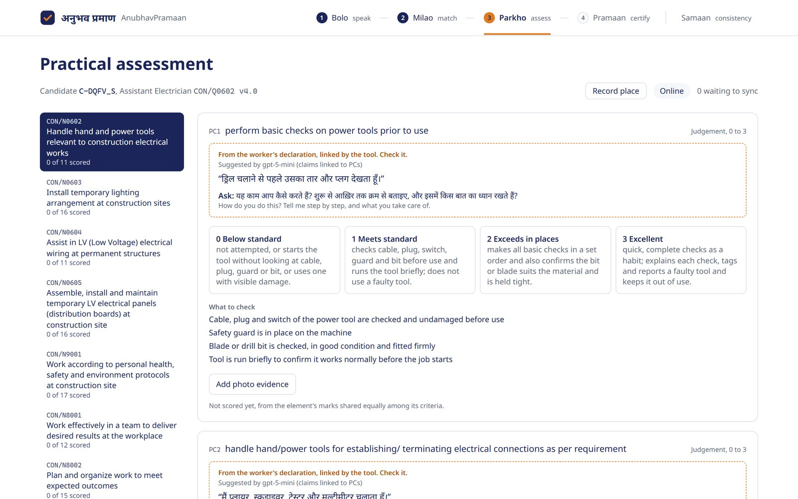
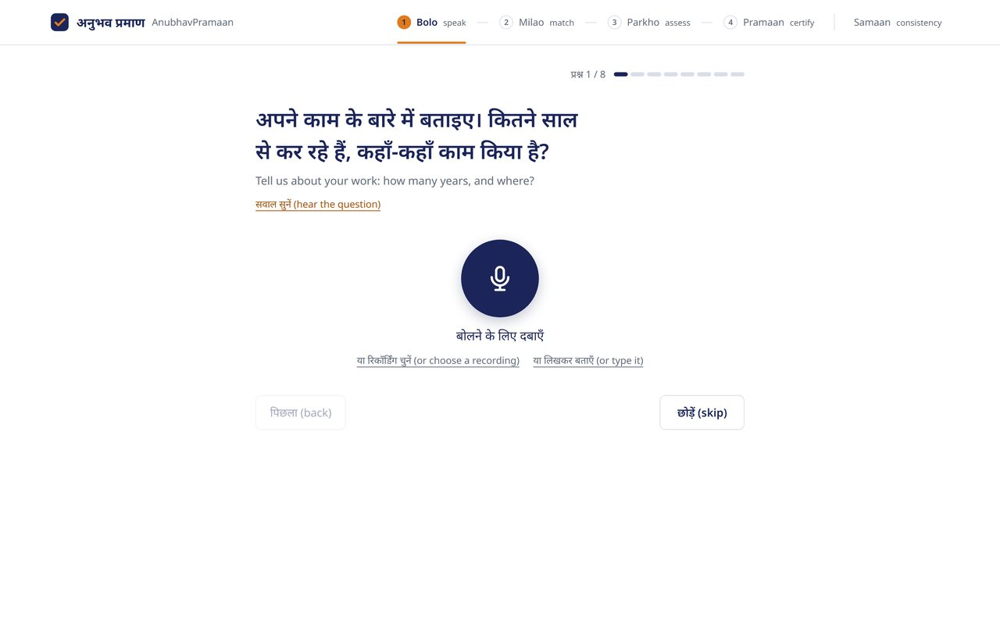
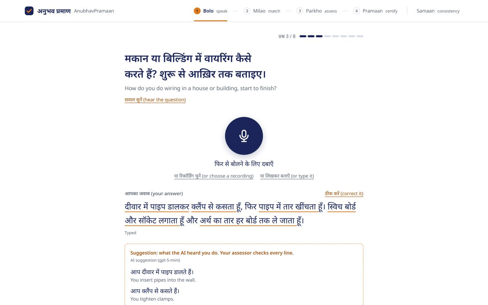
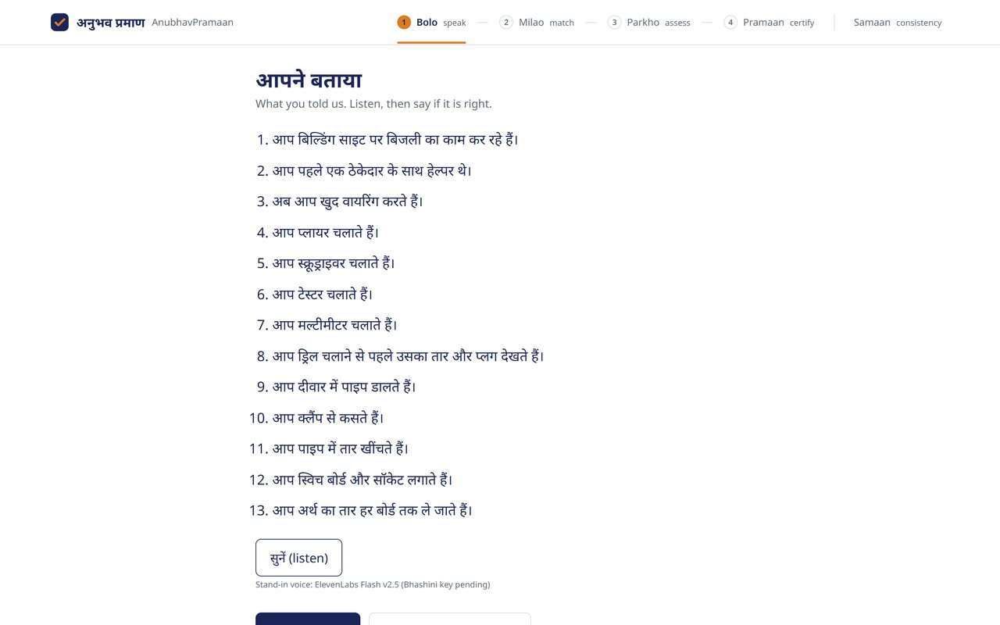
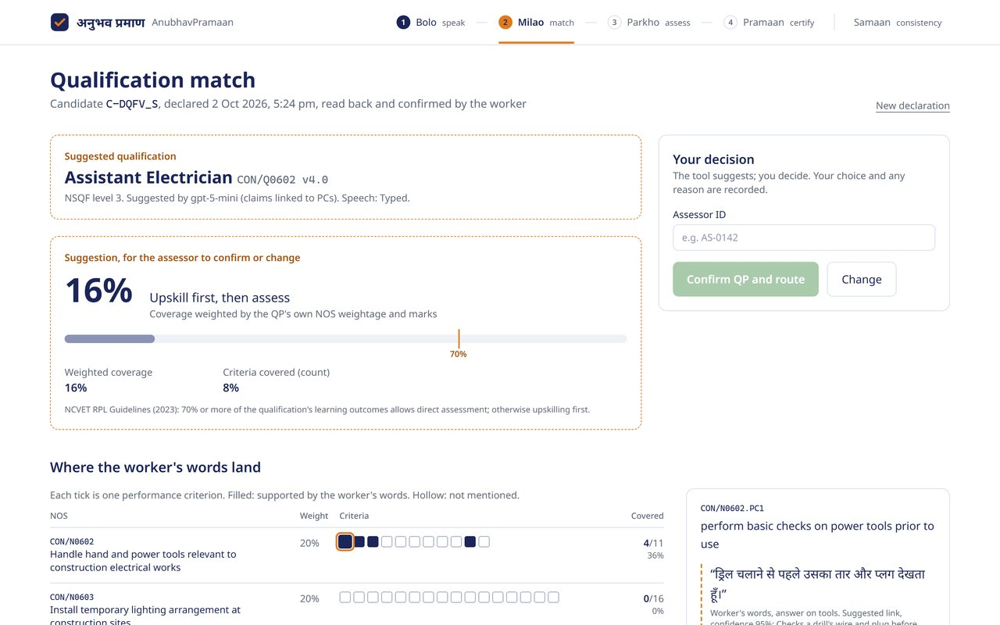
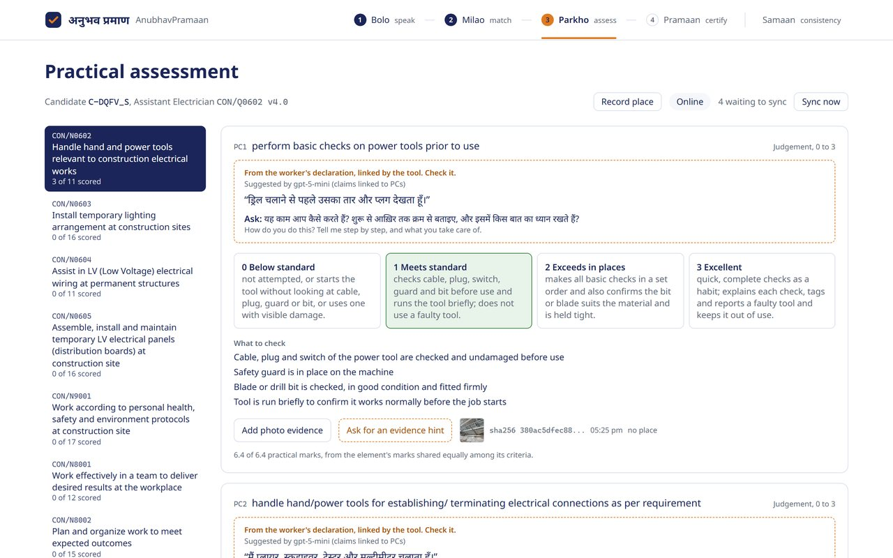
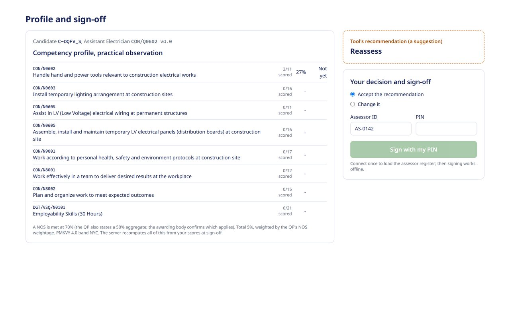
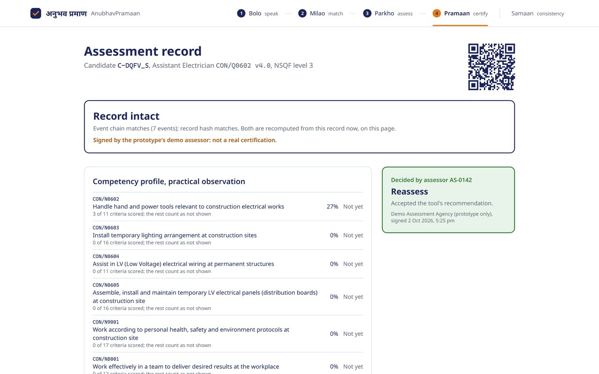
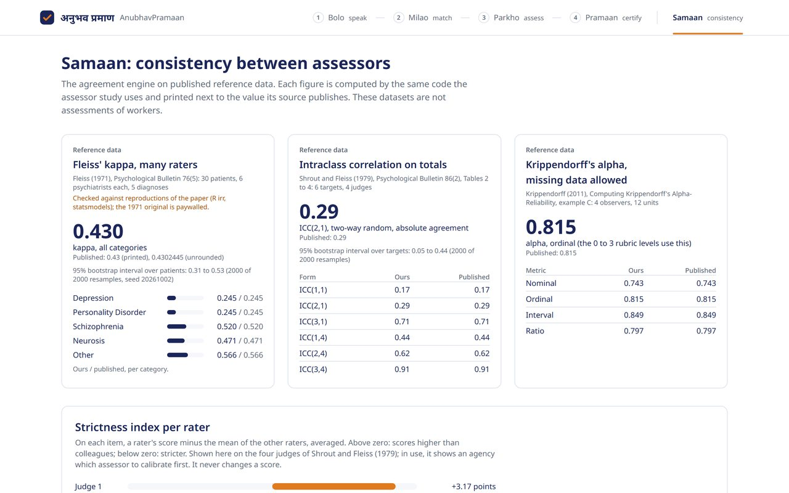
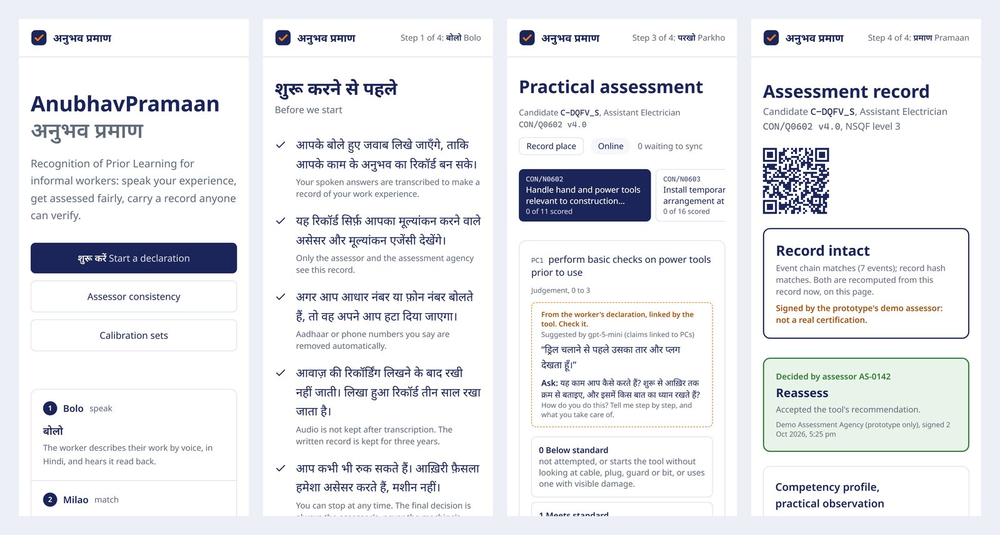

# AnubhavPramaan (अनुभव प्रमाण): proof of experience for India's informal workers

AI-assisted skill assessment for Recognition of Prior Learning (RPL), built for **Smart India Hackathon 2026, PS SIH26242** (Ministry of Skill Development and Entrepreneurship, MSDE: "AI-Assisted Skill Assessment Tool for Recognition of Prior Learning (RPL)", theme: Smart Education) by **Team PixelPaws**.

A worker describes their work by voice in Hindi. The tool turns it into a structured self-declaration, maps it to the closest NSQF qualification pack with NCVET's 70% rule, gives the assessor a standardised checklist with evidence aids, and seals a tamper-evident record that only a human assessor can sign.

**Demo video (2:06):** https://youtu.be/ka0dOzk6eBg



> **AI suggests, the assessor decides.** No code path lets a model set a score, a pass or fail, a route or a certificate decision. Every AI output is labelled as a suggestion, shown with its evidence, and logged next to the assessor's decision in the record.

## Screenshots

One real candidate journey through the running prototype (`/declare` to `/verify`): three typed Hindi answers, claim extraction and mapping by `gpt-5-mini`, the assessor's decisions, a licensed photo, a PIN sign-off. The worker is role-play and the assessor is the public demo assessor.

| | |
|---|---|
|  |  |
| **Bolo, the interview.** Eight questions in Hindi, each can be heard aloud; answer by voice, a recording or typing. | **What the AI heard.** Each claim is tied to a quote that must appear word for word in the answer. |
|  |  |
| **Read back for consent.** The worker hears the summary and confirms or changes it before anything counts. | **Milao, the qualification match.** Coverage per NOS against NCVET's 70% rule, with the worker's quotes as evidence. The assessor confirms or changes it. |
|  |  |
| **Parkho, the practical.** Anchored levels, reference photos, and each photo of the work hashed on the tablet. Works offline. | **Pramaan, the sign-off.** The profile and recommendation are suggestions; only the assessor signs, with ID and PIN, offline too. |
|  |  |
| **The verifiable record.** Hash-chained and recomputed on the page; the QR code opens it. | **Samaan, consistency between assessors.** Every statistic printed next to the value its source publishes. |



**Phone width.** The same app on a phone or camp kiosk, with nothing to install. After one online visit it reloads with the network off.

## The problem

> "In practice, RPL assessment still depends heavily on manual practical evaluation by assessors, which is slow to scale, inconsistent across assessors and locations, and difficult to schedule for workers who cannot easily take time off." (PS SIH26242)

AnubhavPramaan does not replace that assessor. It gives every assessor the same structure, the worker's own words as evidence, and a way to measure how consistently assessors score, and it keeps the human decision at the centre of the record.

## What it does, against the problem statement

| The PS asks for | Where it is |
|---|---|
| **Structured self-declaration**, mapped automatically to the closest NSQF qualification pack | Bolo (`app/declare`, `lib/declaration/`): consent, 8 questions, claims tied to quotes, read-back. Milao (`app/match/[id]`, `lib/mapping/`): claims linked to the pack's own PC ids, coverage per NOS, NCVET's 70% rule [1] |
| **Guided task checklists** and image-based assessment aids | Parkho (`app/assess/[id]`, `components/parkho/`): a checklist built from the pack's PCs, openly licensed reference photos, photo hashing (`lib/evidence/`), and evidence hints (`lib/hints/evidence.ts`) that say per observable "visible", "not visible" or "cannot tell", never a level |
| **Standardised scoring rubrics** across assessors and locations | Written anchors for every judgement PC on the WorldSkills 0 to 3 scale [2], tolerance rules for measurement items (`packs/qp/`, `lib/assess/scoring.ts`); a level that contradicts a hint needs a reason (`lib/assess/deviation.ts`) |
| **NSQF-aligned competency profile** and certification recommendation for assessor sign-off | Pramaan (`app/profile/[id]`, `lib/assess/grade.ts`, `lib/cert/`): profile per NOS, PMKVY 4.0 grade band [3], a recommendation shown as a suggestion, sign-off with assessor ID and PIN, a hash-chained record with a public verify page (`app/verify/[id]`) |
| **Low connectivity**: offline capture, later sync | Service worker (`public/sw.js`), an event outbox in IndexedDB (`lib/offline/outbox.ts`), offline PIN sign-off with an HMAC proof (`lib/offline/signoff.ts`), evidence hints queued until the network is back |
| **Evidence of consistency**: inter-assessor agreement on a test set | Samaan (`app/samaan`, `lib/agreement/`): Fleiss' kappa, Krippendorff's alpha, ICC, bootstrap intervals, a strictness index per assessor. Calibration sets (`app/calibrate`) for real assessors; the study is fixed in advance in [`docs/STUDY-PROTOCOL.md`](docs/STUDY-PROTOCOL.md) |
| **Where the tool supports versus replaces** assessor judgement | The next section |

And two things beyond the list:

- **Integrity checks at sign-off** (`lib/integrity/checks.ts`): reused photos across candidates (perceptual hash) and impossible travel between one assessor's sessions are flagged on the record. The CAG's 2025 audit of PMKVY found reused photos and missing assessor details [4].
- **Hindi speech** through server routes (`lib/voice/`), so no key reaches a browser. Bhashini is the production path; until our key is issued, speech runs on labelled development stand-ins.

## Where the AI stops

| Step | The AI suggests | The person decides |
|---|---|---|
| **Bolo** (speak) | Claims, each tied to a quote from the answer | The worker hears the read-back and confirms or corrects it |
| **Milao** (match) | The qualification, the PC links and the route | The assessor confirms or changes the qualification and route; a change needs a reason |
| **Parkho** (assess) | Per observable: "visible", "not visible" or "cannot tell" | The assessor sets every level; contradicting a hint needs a one-line reason |
| **Pramaan** (certify) | A recommendation and a grade band | The assessor signs with ID and PIN; the server recomputes every mark from the assessor's scores |
| **Samaan** (consistency) | Nothing: plain statistics | Agreement is computed from real assessors' own scores, never from simulated raters |

**Scoring rules** (`lib/assess/`): a PC judged at level 1 ("meets industry standard") or above earns its marks and level 0 earns none, as measurement items earn full marks or none; a PC not scored counts as not shown. A NOS is met at the pass mark the pack states (70% for CON/Q0602).

**Try the assessor flow:** demo assessor `AS-0142`, PIN `2468`. Every record it signs says it is a demo and not a real certification.

## Evidence so far

Each number says what it was measured on.

| What | Measured on | Result | Where |
|---|---|---|---|
| Agreement engine | Published reference data: Fleiss (1971), Shrout and Fleiss (1979), Krippendorff (2011) | 3 of 3 published results reproduced | `tests/unit/agreement.test.ts` |
| Mapping, LLM (`gpt-5-mini`) | Frozen set of 20 synthetic Hindi declarations | Top-1 qualification 20 of 20; PC links precision 92.5%, recall 86.3% | `eval/mapping/runs/20261002-1204-frozen-llm.scored.json` |
| Mapping, keyword baseline (no model) | The same frozen set | Top-1 19 of 20; PC links precision 65.1%, recall 66.8% | `eval/mapping/runs/20261002-0259-frozen-keyword.json` |
| Model cost | Tokens of the scored run at list price | About US$0.04 per candidate (model calls only) | same file, `tokensPerDeclaration` |
| Tests | The prototype | 269 unit and 15 end-to-end tests pass | `pnpm test`, `pnpm test:e2e` |
| With versus without the tool | Not measured yet | Needs several independent human raters | [`docs/STUDY-PROTOCOL.md`](docs/STUDY-PROTOCOL.md) |

**How to read these.**

- **The agreement engine** reproduces Shrout and Fleiss (1979, ICCs of Table 4) and Krippendorff (2011, alpha examples), checked against the original papers. Fleiss (1971, kappa 0.430) is checked against published reproductions, because the 1971 paper is closed access. This shows the statistics are computed correctly. It does not show that the tool improves agreement.
- **The frozen set** has 20 declarations (full, partial, short, Hinglish, another trade). Their expected qualification, PCs and route were frozen by SHA-256 before any mapper code existed (`eval/mapping/FROZEN.md`).
- **The LLM run** used prompts extract-v1 and link-v4, tuned on a separate two-declaration dev set only, and was scored under a reporting rule written before any score was seen.
  - Route agreement was 19 of 20 under the flat coverage rule and 17 of 20 under the weighted rule.
  - 2 of 156 answers (in D02 and D06) were blocked by the provider's content filter and handled by rule-based extraction, as in the live app. On the 18 declarations where every claim came from the model: top-1 18 of 18, precision 91.3%, recall 86.5%.
  - On average a declaration used 21,661 prompt and 15,037 completion tokens.
- **The keyword baseline** had route agreement of 18 of 20 under the flat rule and 15 of 20 under the weighted rule.
- **These numbers are likely optimistic.** The declarations and the pack synonyms were both written with AI help and share trade vocabulary. Results for held-out role-play recordings by the project lead will be added here once they are run.
- **We never simulate raters or use a model as a rater.** The with and without study runs with real assessors on the ministry's dummy assessment data, as fixed in the protocol.

## Qualification packs

`packs/qp/` holds two packs, extracted by script from the official PDFs (`tools/extract_qp.py`). A second extractor cross-checks each one (`tools/verify_pack_text.py`), and each pack records its PDF's URL and SHA-256.

- **Assistant Electrician, CON/Q0602 v4.0, NSQF level 3** (the pilot): 119 PCs. Every judgement PC has anchors and observables, adapted from the CSDCI assessment guide where it covers the activity; the 2 measurement items each name their source.
- **Mason General, CON/Q0103 v1.0**: 165 PCs. The QP is deactivated, so this pack only shows that mapping tells trades apart; it never scores a candidate.

The PC counts are asserted in `tests/unit/packs.test.ts`. A new trade is a new pack: the extracted text plus a reviewed overlay of anchors, observables, tolerances and Hindi synonyms.

## Run it

Needs Node 20 or newer and pnpm 10.

```bash
pnpm install
cp .env.example .env.local   # every key is optional
pnpm dev                     # http://localhost:3000
```

Without keys the app still runs:

- mapping uses the keyword baseline
- claim extraction uses rules
- photo hints say they are unavailable
- the voice routes report that no recogniser is configured

`.env.example` explains each key:

- **Bhashini:** Hindi speech, the production path.
- **ElevenLabs Scribe:** a labelled development stand-in for speech recognition, with Groq Whisper as its fallback.
- **Azure AI Foundry (`gpt-5-mini`):** the text model and the photo hints.
- **Upstash:** a durable record store.

```bash
pnpm test                    # unit tests, mocked providers, no keys needed
pnpm test:e2e                # Playwright; starts the dev server
pnpm typecheck && pnpm lint
AP_EVAL_MODE=keyword AP_EVAL_SET=frozen npx vitest run --config vitest.eval.config.mts
```

## Privacy

- Consent before any recording; declining records nothing.
- Aadhaar, PAN, phone and other long numbers are redacted on the server, from transcripts and from the assessor's reasons, before they are sealed in a record (`lib/cert/redact.ts`).
- No face identification anywhere.
- Records keep text, scores, decisions and hashes. Speech audio, photos and video are not stored in them; in this prototype photos stay on the tablet.
- A place is taken only when the assessor taps "Record place", rounded to about 1 km, and used only for the travel check.
- Records expire after 3 years, the period the CSDCI assessment guide sets for assessment evidence [5]; the design follows the Digital Personal Data Protection Act, 2023.
- The speech stand-ins are for development and role-play audio only, never real worker data. Production uses Bhashini.

**Status:** a working prototype for the idea round, October 2026, not for real certification. The demo assessor is public, and Hindi speech runs on labelled development stand-ins until the Bhashini key is issued.

## Repository layout

```
app/              pages (/declare, /match, /assess, /profile, /verify, /samaan, /calibrate) and API routes
components/       screens for Bolo, Milao, Parkho, Pramaan and calibration
lib/              declaration, mapping, scoring, certificate chain, integrity checks,
                  agreement statistics, voice, offline outbox
packs/qp/         qualification packs, their reviewed overlays and extraction sources
data/             published reference datasets, the demo calibration set and assessor register
eval/mapping/     the frozen eval set, its runner and every run log
tests/            unit tests (Vitest) and the browser suite (Playwright)
tools/            pack extraction and review (Python)
docs/             product and technical requirements, prior art, study protocol
```

Design documents: [`docs/PRD.md`](docs/PRD.md) (requirements R1 to R18), [`docs/TRD.md`](docs/TRD.md) (modules M1 to M9, cited in the code), [`docs/PRIOR-ART.md`](docs/PRIOR-ART.md) (sources and the gap analysis), [`docs/STUDY-PROTOCOL.md`](docs/STUDY-PROTOCOL.md) (the with and without study).

## Sources

1. NCVET, Guidelines for Recognition of Prior Learning, 2023. https://ncvet.gov.in/wp-content/uploads/2023/08/Final-RPL-guidelines.pdf
2. WorldSkills Europe, EuroSkills 2025 Technical Description TD19, section 4.6. https://worldskillseurope.org/application/files/7817/1387/4841/ES2025_TD19_en.pdf
3. MSDE, PMKVY 4.0 Guidelines. https://www.msde.gov.in/static/uploads/2024/02/PMKVY-4.0-Guidelines_final-copy.pdf
4. CAG, Report No. 20 of 2025, Performance Audit of PMKVY. https://cag.gov.in/uploads/download_audit_report/2025/Report-No.-20-of-2025_PA-PMKVY_English-PDF-A-06943abec463479.68516873.pdf
5. CSDCI, Mason General assessment guide. https://www.csdcindia.org/wp-content/uploads/2023/05/AG_Mason-General.pdf

More sources and the gap analysis are in [`docs/PRIOR-ART.md`](docs/PRIOR-ART.md).

## Licence

Code: MIT, see `LICENSE`. Fonts: Noto Sans and Noto Sans Devanagari under the SIL Open Font License 1.1, see `public/fonts/`. Reference and calibration photos: Wikimedia Commons, each with its author and licence in `public/evidence/ATTRIBUTION.md`. Qualification pack text is quoted from the official documents linked in each pack.
