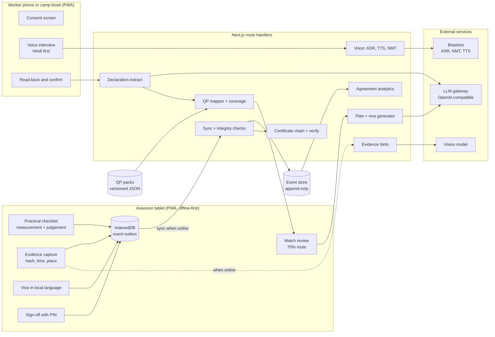

# TRD: AnubhavPramaan technical design

**Companion to:** `docs/PRD.md` · **Version:** 1.0, 2 Oct 2026 · Source keys such as [S1] resolve in `docs/PRIOR-ART.md`.

---

## 1. Architecture



**Design rules**
1. **Deterministic core, advisory AI.** Coverage, routing, scoring, grading and hashing are plain code with unit tests. Models only extract, suggest and flag, and their outputs are validated with zod against closed sets (QP and PC ids).
2. **Append-only events.** Every action on the tablet is an event with a client-generated id and the previous event's hash. State is a reduction of events. Sync is idempotent.
3. **Offline by default on the assessor side.** Checklist, scoring, capture and sign-off never need the network. Voice transcription and AI hints queue until online, and the UI says so.

## 2. Stack

| Layer | Choice | Why |
|---|---|---|
| App | Next.js 15, React 19, TypeScript, Tailwind 4, shadcn | Copied from Saakshi, already tested and deployable |
| Validation and state | zod 4, zustand 5 | Same as Saakshi |
| Offline | Service worker (Serwist or hand-written), IndexedDB via `idb` | App shell precache plus event outbox |
| Voice | Bhashini ASR, NMT and TTS via server routes; AssemblyAI Hindi streaming as fallback while the Bhashini key is pending | Government language stack, 22 voice languages [V1] |
| LLM | Saakshi `lib/analyzer/gateway.ts` (`structuredGatewayCall`), any OpenAI-compatible host (Groq default) | JSON schema output with fallbacks already handled |
| Vision hints | A multimodal model through the same gateway | Hints only, never scores [M9] |
| Certificates | Saakshi `lib/cert/*` (canonical JSON, SHA-256 chain, QR verify page) | Already built and tested |
| Persistence | In-memory plus Upstash KV for the demo; Postgres for production | Matches Saakshi's deployment notes |
| Tests | Vitest, Playwright (fake microphone from WAV, offline context) | Saakshi patterns |
| Deploy | Vercel (HTTPS keeps `crypto.subtle` available offline after install) | Saakshi `docs/deployment.md` |

## 3. Data model (zod sketches)

```ts
// packs/qp/*.json, validated by lib/packs/schema.ts
QualificationPack {
  id: "CON/Q0602"; version: "4.0"; title: "Assistant Electrician";
  nsqfLevel: 3; sector: "Construction"; passRule: { perNosPct: number; totalPct: number };
  nos: Nos[]; source: { url: string; fetchedAt: string };
}
Nos { id: string; title: string; marks: { theory: number; practical: number; viva: number }; pcs: Pc[] }
Pc {
  id: string; text: string; textHi?: string; marks: number;
  type: "measurement" | "judgement";
  tolerance?: { target: number; plusMinus: number; unit: "mm" | "Mohm" | "V" | "deg" };
  anchors?: [string, string, string, string];   // levels 0..3, judgement items only
  observables?: string[];                        // what a reviewer can check in evidence
  exemplars?: { level: 0|1|2|3; image: string }[];
  synonyms?: string[];                           // Hindi and trade words used in mapping
}

SelfDeclaration { id; candidateRef; lang; transcript; claims: Claim[]; confirmedAt?: string; consentAt: string }
Claim { id; summary; quote; tasks: string[]; tools: string[]; years?: number; setting?: string }

MappingResult {
  qp: { id; version }; perNos: { nosId; coveredPcs: string[]; totalPcs: number; pct: number }[];
  overallPct: number; route: "direct-assessment" | "upskill-first";   // suggestion only
  links: { claimId; pcId; confidence: number; rationale: string }[];
  gaps: { nosId; pcIds: string[] }[];
}

EvidenceItem { id; pcId; kind: "photo" | "video"; sha256; dHash?: string; capturedAt; lat?; lon?; deviceId }
ScoreEvent  { id; pcId; assessorId; level?: 0|1|2|3; reading?: number; hintRef?: string; justification?: string; at }
CompetencyProfile { perNos: { nosId; pct; pass: boolean }[]; totalPct; band: "A"|"B"|"C"|"NYC"; recommendation: "certify"|"partial"|"reassess" }
CertificateRecord { id; packRef; declarationHash; evidenceHashes: string[]; scoresHash; aiLedger; assessorId; signedAt; chainHead }
```

## 4. Modules

### M1. Voice self-declaration (reuse: Saakshi phase machine, Viva policy, SagarDrishti Bhashini)
- Consent screen first (DPDP Act 2023), in the chosen language.
- Interview policy picks the next topic from NOS not yet covered by any claim (Viva `pickTopics` pattern), with a hard cap on turns and a polite close.
- Each answer: browser capture to 16 kHz mono WAV (`toWav16k`), Bhashini ASR, text normalisation (`normalise`, `devanagari.ts`), redaction of Aadhaar and phone numbers (`redactIdentifiers`).
- Extraction: one structured LLM call per answer returns `Claim[]`, each with a verbatim `quote` that must be a substring of the transcript (rejected otherwise).
- Read-back: a short summary spoken back via Bhashini TTS (teach-back pattern from Saakshi); the worker answers yes or corrects; the confirmation is an event.

### M2. QP pack library and mapper
- Packs are hand-verified JSON built from the official QP PDFs [S6, S7] with a helper script (`tools/extract_qp.py`), reviewed line by line. Every pack stores its source URL and version.
- **Mapping:**
  1. A structured LLM call links each claim to zero or more PC ids. The schema's enum is the pack's PC ids, so unknown ids cannot appear. Each link carries a confidence and a rationale that cites the quote.
  2. Links below 0.6 confidence are dropped.
  3. **Coverage (code, not model):** for each NOS, covered PCs divided by total PCs. Overall coverage is covered PCs divided by all PCs in the pack (learning outcomes counted as PCs, the closest match to NCVET's wording [S1]). The marks-weighted figure is shown alongside.
  4. **Route suggestion:** overall coverage of 70% or more suggests direct assessment; otherwise upskill first, with the uncovered PCs grouped by NOS as the bridge plan [S1].
- With 2 or 3 packs in the prototype every pack is scored and the best is suggested. The scale path is embedding retrieval over all active NQR qualifications (2,685 [S4]) followed by the same constrained linking.

### M3. Assessment plan and viva generator
- Practical tasks per NOS ordered by PC marks; the assessor can edit, swap or drop.
- Viva questions grounded in the worker's own claims and the NOS knowledge items, as NCVET requires questions based on prior job experience and mapped to PCs [S1]. Questions are validated with Saakshi's `validateQuestion` (no invented numbers, no leading questions).

### M4. Assessor co-pilot
- **Measurement items:** full marks if `|reading - target| <= plusMinus`, else zero, the CSDCI and WorldSkills convention [S7, S33].
- **Judgement items:** level 0 to 3 with the PC's own anchors and exemplar images. Marks awarded = `pc.marks * level / 3`.
- **Evidence hint (when online):** the vision model receives the photo and the PC's `observables` and returns, per observable, `visible | not_visible | cannot_tell` with a one-line reason. It never returns a level.
- **Deviation rule:** a justification of at least 10 characters is required when the assessor picks level 2 or 3 while a required observable is `not_visible`, or level 0 or 1 while every observable is `visible`. Both choice and reason are stored.
- **Viva hint:** key points expected for the question are matched against the answer transcript and shown as "mentioned" or "not heard". The assessor scores.

### M5. Evidence integrity
- SHA-256 of every media file on the device at capture time; the hash goes into the event chain before upload.
- 64-bit difference hash (dHash) per photo; a Hamming distance of 6 or less across different candidates or batches raises "possible reused photo", the CAG's finding [S14].
- Impossible travel: two sessions by one assessor implying more than 120 km/h between their locations raises a flag (CAG found 80 such cases for inspectors [S14]).
- Sign-off is refused without an assessor id and PIN; CAG found assessor details missing in 3,27,220 batches [S14].

### M6. Competency profile and certificate
- Per NOS percentage against the pack's pass rule; total percentage; PMKVY 4.0 band for levels 1 to 3: A at 85% and above, B 70% to below 85%, C 50% to below 70% [S11]; below that "not yet competent".
- Recommendation (suggestion): certify if every NOS passes; partial if some NOS pass (credit per NOS plus a bridge plan); otherwise reassess.
- Assessor PIN sign-off. The record (pack id and version, declaration hash, evidence hashes, scores, AI hint ledger, assessor id) is canonicalised and hash-chained with Saakshi `lib/cert/chain.ts`; the server re-verifies at sync and returns 422 on mismatch; QR opens `/verify/[id]`.
- The AI ledger (what the tool suggested versus what the assessor decided) is part of the record and printed on the verify page.

### M7. Agreement analytics
- **Fleiss' kappa** for PC met or not met across many raters [M4].
- **Krippendorff's alpha (ordinal)** for 0 to 3 judgement levels across many raters, tolerant of missing ratings; **quadratic weighted kappa** for any pair.
- **ICC(2,1)**, two-way random, absolute agreement, for item totals [M3].
- 95% bootstrap confidence intervals over items (2,000 resamples).
- **Strictness index** per assessor: mean of (their level minus the mean of the other raters on the same PC), in rubric points. Examiner stringency explained 12% of score variance in one large exam [M6].
- Unit tests reproduce published reference values (Fleiss 1971 example for kappa; Shrout and Fleiss 1979 example for ICC; Krippendorff 2011 example data for alpha), with the source cited in each test.

### M8. Offline-first PWA
- Service worker precaches the app shell, fonts and the active QP packs.
- IndexedDB stores: `events` (append-only outbox), `media` (blobs with sha256), `packs`, `session`.
- Sync: `POST /api/sync` with a batch of events; the server ignores ids it has already seen and returns accepted ids; media uploads go separately to `POST /api/media` with the expected hash, rejected on mismatch.
- Conflict policy: one candidate session is owned by one assessor device, events are append-only, so conflicts cannot occur by design.
- Voice and hints recorded offline are queued and processed after sync; the UI shows "waiting for network" rather than pretending.

## 5. API routes

| Route | Purpose |
|---|---|
| `POST /api/voice/asr`, `POST /api/voice/tts` | Bhashini proxy; AssemblyAI fallback for ASR |
| `POST /api/declaration/turn` | Next interview question or close |
| `POST /api/declaration/extract` | Answer transcript to `Claim[]` |
| `POST /api/mapping` | Claims to `MappingResult` |
| `POST /api/plan` | Mapping and declaration to tasks and viva questions |
| `POST /api/hints/evidence`, `POST /api/hints/viva` | Advisory hints |
| `POST /api/sync`, `POST /api/media` | Offline outbox upload |
| `POST /api/certificate`, `GET /verify/[id]` | Issue and verify the hash-chained record |
| `GET /api/packs`, `GET /api/packs/[id]` | Pack library |
| `POST /api/calibration/score`, `GET /api/agreement` | Calibration and agreement report |
| `POST /api/import/dummy` | Import the ministry's dummy worker-assessment data at the finale (R16) |

## 6. Evidence plan

Agreement improvement needs several independent human raters, so it is measured in stages and every number is labelled with what it is. We never simulate raters and never use a model as a "rater".

**Stage 1, idea submission: the engine is correct.**
- The agreement module reproduces published reference results: the worked example in Fleiss (1971) for Fleiss' kappa, the example in Shrout and Fleiss (1979) for ICC, and the example data in Krippendorff (2011) for alpha. The expected values are taken from those sources and recorded in the tests, with the citation.
- The Samaan dashboard is demonstrated on those published datasets, labelled "reference data".

**Stage 1, idea submission: the mapper is measured.**
- 20 synthetic Hindi declarations with expected QP, PC ids and route are written before the mapper exists and frozen by SHA-256 (`eval/mapping/FROZEN.md`). Labels are only changed through a logged correction with a reason.
- 3 to 5 role-play voice recordings form a held-out set. Report top-1 QP accuracy, PC-link precision and recall, and route agreement, each with its set size.

**Stage 2, grand finale: with versus without the tool.** Fixed in advance in `docs/STUDY-PROTOCOL.md`, committed before the finale. Modelled on Schauber et al. 2024, where 10 examiners scoring the same 4 videos reached a Fleiss' kappa of only 0.07 on pass or fail [M7].
- **Items:** evidence from the ministry's dummy worker-assessment data (the PS says it will be provided), or openly licensed photos and videos of electrical work, each with 3 to 5 PCs and a hidden answer key.
- **Raters:** every available assessor or volunteer. Crossover: group A scores set X unaided (plain PC text only) and set Y assisted (anchors, exemplars, hints); group B does the reverse.
- **Report:** Fleiss' kappa and Krippendorff's alpha (ordinal) per condition, ICC(2,1) on totals, bootstrap 95% CIs, accuracy against the answer key, and the strictness index per rater.
- **Rule:** the analysis is fixed before any score is seen. Results are reported whether or not they favour the tool.

## 7. Security and privacy
- Consent before recording; the candidate can stop at any time.
- Redaction of Aadhaar, PAN and phone numbers, including spoken Hindi digits (Saakshi `redact.ts`).
- No face identification; aggregate presence checks stay with the agency's existing process.
- Evidence retention: 3 years, matching the CSDCI assessment guide [S7], then deletion; hashes remain for verification.
- Role-based access: candidate, assessor, agency QA, ministry viewer.

## 8. Testing
- **Unit:** pack schema; coverage and route; tolerance scoring; band and recommendation; deviation rule; kappa, alpha and ICC against reference values; dHash and duplicate detection; impossible travel; chain verification.
- **Mapping eval:** 20 or more Hindi declarations written by the team with expected QP and PCs, reporting top-1 QP accuracy and PC-link precision and recall.
- **E2E (Playwright):** fake microphone from a WAV file (Saakshi pattern); full flow online; the assessor flow with `context.setOffline(true)`, then back online with sync verified and no lost events.

## 9. Reuse map

Roots: `[S]` = `D:\Projects\Saakshi`, `[V]` = `D:\Projects\Viva`, `[SD]` = `D:\Projects\SagarDrishti`.

| Need | Reuse | Effort |
|---|---|---|
| Phase machine for the interview | `[S]/lib/session/machine.ts` | M |
| Interview topic policy and guardrails | `[V]/lib/engine/policy.ts`, `turn.ts`, `[V]/lib/llm/schemas.ts` | M |
| Question validation | `[S]/lib/teachback/questions.ts` (`validateQuestion`, `fallbackQuestions`) | S |
| Bhashini ASR, TTS, NMT | `[SD]/services/agent/app/voice.py` ported to TS (about 150 lines), `[SD]/apps/web/lib/voice.ts` (`toWav16k`, `playWav`) | M |
| Hindi normalisation and redaction | `[S]/lib/rules/normalise.ts`, `[S]/lib/session/devanagari.ts`, `[S]/lib/cert/redact.ts` | S |
| Fallback Hindi STT | `[S]/lib/aai/*`, `public/worklets/pcm-capture.js` | S |
| LLM gateway | `[S]/lib/analyzer/gateway.ts`, `config.ts` | S |
| Rubric packs and checklist board | `[S]/lib/rules/pack.ts`, `[S]/lib/session/board.ts`, `[S]/components/checkpoint-board.tsx` | M |
| Certificates and verify page | `[S]/lib/cert/*`, `[S]/app/api/certificate/route.ts`, `[S]/app/verify/[id]/page.tsx` | S to M (rename roles) |
| Eval harness and metrics page | `[S]/lib/eval/*`, `[S]/app/metrics/page.tsx` | S |
| Indic fonts | `[SD]/apps/web/public/fonts/*` with `NOTICE.txt` and `OFL-1.1.txt` | S |
| Video recording | `[SD]/tools/record_demo.mjs` | S |
| Deck pipeline | `[SD]/.ppt-build/` scripts | M |

**Strip from the Saakshi copy:** `lib/demo/`, `public/demo/*.pcm`, judge-solo files, the intervention and nudge flow, prohibited-claims logic, keyterm experiments and their specs, the ULIP and loan packs, `app/cover`, `tabla-preview`, `scripts/render-*.ps1`, the theme. The AssemblyAI Voice Agent "mouth" is English only, so Hindi speech output uses Bhashini TTS.

**Build new:** service worker and outbox, camera capture, agreement module, QP packs and mapper, deviation rule, integrity checks, assessor sign-off, PIN roles.

## 10. Environment variables

| Variable | Used by |
|---|---|
| `BHASHINI_USER_ID`, `BHASHINI_API_KEY`, `BHASHINI_INFERENCE_KEY`, `BHASHINI_PIPELINE_ID` (default `64392f96daac500b55c543cd`) | Voice routes |
| `LLM_PROVIDER_API_KEY`, `LLM_PROVIDER_BASE_URL`, model variables from Saakshi `config.ts` | Extraction, mapping, plan, hints |
| `ASSEMBLYAI_API_KEY` | Fallback ASR |
| `KV_REST_API_URL`, `KV_REST_API_TOKEN` | Optional persistence |
| `NEXT_PUBLIC_APP_URL` | QR and verify links |

## 11. Repository layout

```
app/            routes: / (role picker), /declare, /match/[id], /assess/[id], /profile/[id], /verify/[id], /calibrate, /dashboard
components/
lib/
  voice/        bhashini.ts, capture.ts
  declaration/  policy.ts, extract.ts, schemas.ts
  packs/        schema.ts, load.ts
  mapping/      link.ts, coverage.ts, route.ts
  assess/       plan.ts, scoring.ts, deviation.ts, grade.ts
  evidence/     hash.ts, dhash.ts
  hints/        evidence.ts, viva.ts
  cert/         (from Saakshi)
  agreement/    fleiss.ts, alpha.ts, icc.ts, weighted-kappa.ts, bootstrap.ts, strictness.ts
  integrity/    duplicates.ts, travel.ts
  offline/      db.ts, outbox.ts, sync.ts
  analyzer/     gateway.ts (from Saakshi)
packs/qp/       CON-Q0602-v4.0.json, CON-Q0103.json
data/calibration/  items, answer key, rater scores
eval/           mapping eval set and runner
tests/          unit/, e2e/
tools/          extract_qp.py, capture_screens.mjs, record_demo.mjs
```
